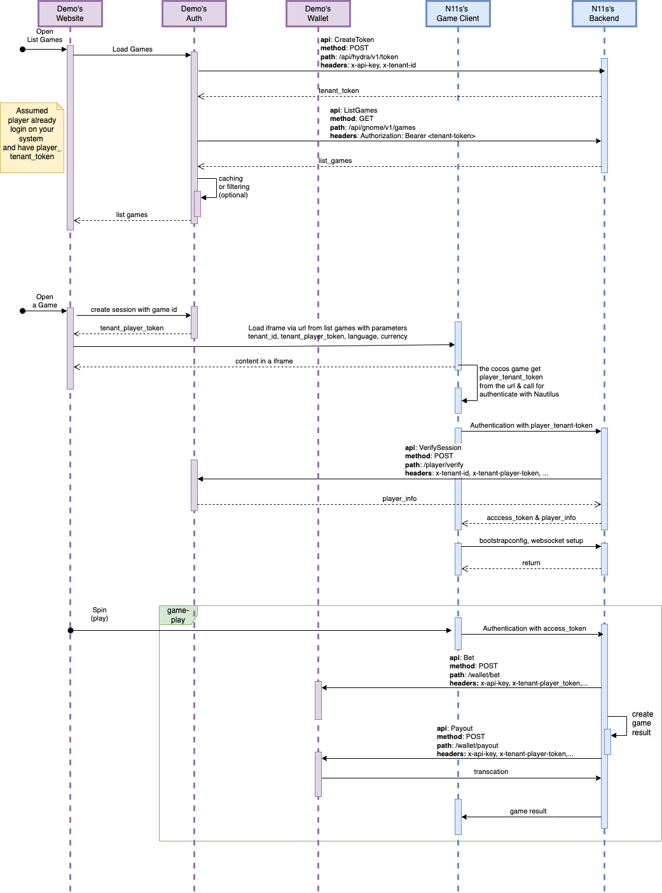

# Demo

This project demonstrates how to integrate with Nautilusgames, providing a clear and concise example for developers. It is designed for software developers and technical teams who are looking to understand and implement integration with Nautilusgames in their own applications. The integration is based on the guidelines and documentation available at [Nautilus Games Documentation](https://docs.nautilusgames.com/).

## Run Locally

### Environment Variables

To run this project, you will need to add the following environment variables to your .env file

- MySQL

  - `MYSQL_PASSWORD`
  - `MYSQL_ROOT_PASSWORD`
  - `MYSQL_DATABASE`
  - `MYSQL_USER`

- Database

  - `DB_HOST`
  - `DB_PORT`
  - `DB_NAME`
  - `DB_USERNAME`
  - `DB_PASSWORD`

- Tenant

  - `TENANT_ID`
  - `TENANT_API_KEY`
  - `TENANT_TOKEN_URL`

- Auth

  - `PLAYER_SIGNING_KEY`
  - `TENANT_PLAYER_SIGNING_KEY`

#### Clone the project

```bash
git clone https://github.com/nautilusgames/demo.git
```

#### Install dependencies

```bash
  go mod tidy && go mod vendor
```

#### Start the server

```bash
  source ./env && go run auth/cmd/main.go -c auth/configs/config.yaml
```

## API Integration Flow




## API Reference

[Integration API](https://docs.nautilusgames.com/api)